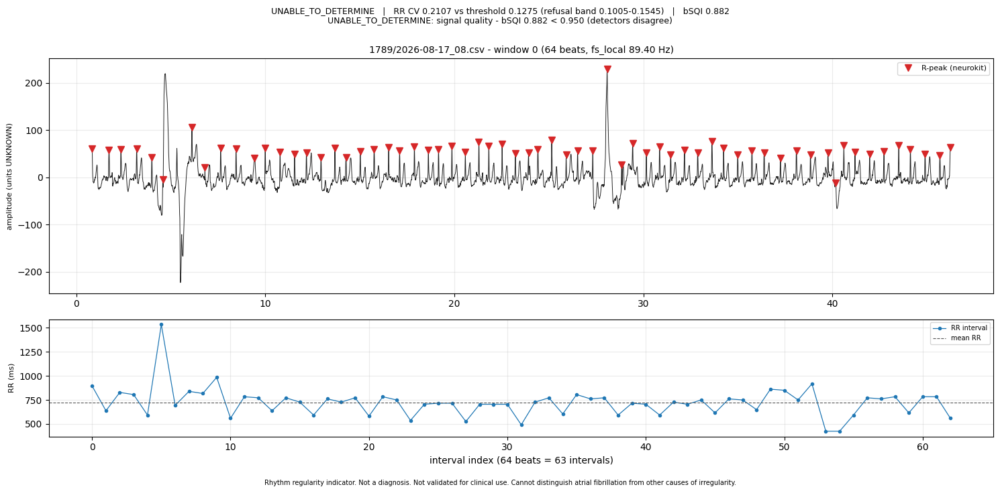
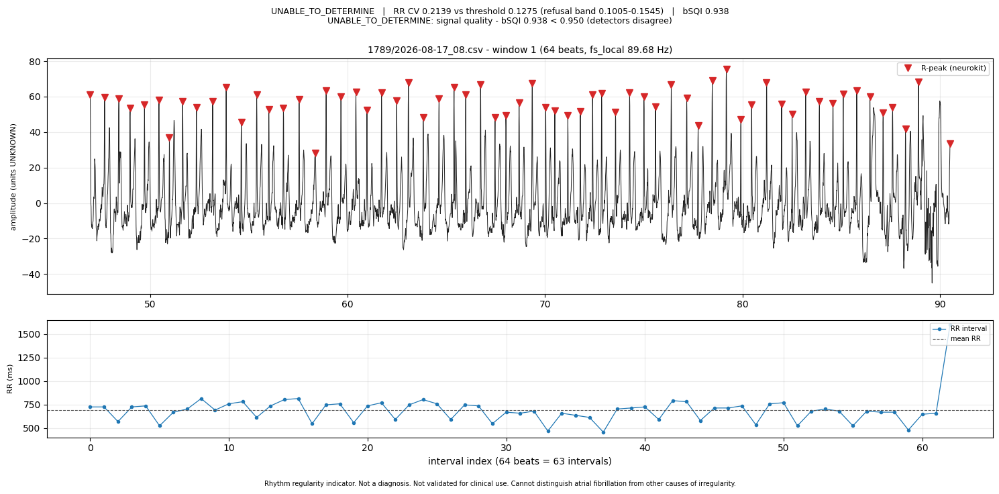
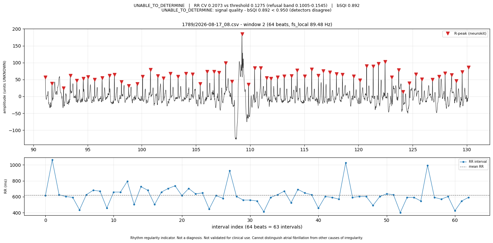

# Rhythm regularity review - 1789/2026-08-17_08.csv

> **Rhythm regularity indicator. Not a diagnosis. Not validated for clinical use. Cannot distinguish atrial fibrillation from other causes of irregularity.**

## Device-domain gate: UNVALIDATED

- rhythm verdict: permitted
- clinical severity: **BLOCKED**
- MedGemma report: **BLOCKED**

No device-domain validation artifact exists. Device R-peak timing has never been checked against a beat-level reference, so no clinical severity may be emitted and MedGemma must not be called. Rhythm verdicts remain available as engineering output only.

## Provenance

- SHA-256 `cb1cd17d71d1684a26bf9b64bd83ab22...`
- Raw samples 200,901; **replayed rows removed 0**
- Analysed segment 1847 s at measured **89.598 Hz**
- Detectors: `neurokit` (primary), `rodrigues2021` (bSQI second opinion)
- Gate: bSQI >= 0.95, lag-1 >= -0.5 guarded above SDNN 15.0 ms

## Threshold

RR CV >= **0.1275**, refusal band +/-0.027

| field | value |
|---|---|
| status | PROVISIONAL - NOT SHIPPABLE |
| shippable_blocked_on | no device-anchored REGULAR distribution exists; the ProRhythm REGULAR distribution measured to date is an artefact of R-peak detection error (device windows median RR CV 0.19 vs 0.03 for healthy LTAFDB windows). Unblocks on a controlled recording with a beat-level RR reference. |
| feature | rr_cv |
| threshold | 0.1275 |
| loro_spread | 0.0125 |
| loro_range | [0.12, 0.1325] |
| refusal_half_width | 0.027 |
| derived_on_database | ltafdb |
| derived_on_records | 16 |
| derived_on_hours | 389 |
| derived_on_windows | 21920 |
| n_regular_windows | 15016 |
| n_irregular_windows | 6904 |
| resampled_rate_hz | 89.7 |
| rr_source | expert_annotations |
| lead | UNVERIFIED |
| held_out | none - full derivation set |
| operating_point | Youden; only the REGULAR verdict is actionable |
| threshold_ci95_cluster_bootstrap | [0.115, 0.1525] |
| ci_method | record-level (cluster) bootstrap, 1000 resamples of 16 LTAFDB records |
| ci_note | Re-derived on 16 records (was 6). LORO spread narrowed 0.0550 -> 0.0125 and the CI halved (0.0752 -> 0.0375 wide). IRREGULAR windows now come from 14 records with a top-2 share of 44% (was 4 records, 76%). MITDB's own Youden optimum is 0.1350, agreeing to within 0.0075. |
| held_out_database | mitdb |
| held_out_se | 0.9839 |
| held_out_sp | 0.866 |
| held_out_ppv | 0.4692 |
| held_out_npv | 0.9978 |
| sensitivity | 0.9607 |
| specificity | 0.8871 |
| ppv | 0.7965 |
| npv | 0.9801 |
| noise_floor_cv | 0.006 |
| validated_on_device | False |

## Operating point

**Youden threshold; only the REGULAR verdict is actionable.**
NPV falls monotonically as the threshold tightens, while PPV only exceeds
0.80 where sensitivity has collapsed to 0.13. A REGULAR call is trustworthy
(NPV ~0.998); an IRREGULAR call (PPV ~0.40) prompts a look and must never
fire an alarm on its own.

## Verdicts

39 windows of 64 beats:

- **IRREGULAR**: 1 (2.6%)
- **UNABLE_TO_DETERMINE**: 38 (97.4%)

- action state **REGULARITY_NOT_ESTABLISHED**: 39 (100.0%)

Hysteresis transitions (5 agreeing windows required): 0

## Axes

Three independent axes, each refusing independently. A flat label cannot express partial confidence.

- **Rate**: NORMAL 34 (87%), UNDETERMINED 5 (13%)
- **Regularity**: UNABLE_TO_DETERMINE 38 (97%), IRREGULAR 1 (3%)
- **Events (ectopy burden)**: UNDETERMINED 38 (97%), LOW 1 (3%)
- **Combined severity**: WITHHELD 39 (100%)

- pauses over 2000 ms: **0** across 39 windows
- windows escalating to CRITICAL: **0**

> Rate bands 40/150 bpm are ADOPTED convention, not derived or validated in this project. The ectopy axis reports BURDEN only - the TYPE of ectopic beat is not determinable from beat timing.

## Windows

### Window 0 - UNABLE_TO_DETERMINE

- UNABLE_TO_DETERMINE: signal quality - bSQI 0.882 < 0.950 (detectors disagree)
- RR CV 0.21065873828654594, RMSSD 224.26543225785298 ms, HR 83.02583025830256 bpm
- flagged intervals 0/63
- bSQI 0.8823529411764706, SQI FAIL - bSQI 0.882 < 0.950 (detectors disagree)
- **axes** - rate: NORMAL | regularity: UNABLE_TO_DETERMINE | events: UNDETERMINED (0 couplets, 0 pauses) -> **WITHHELD**
- narrative source: **template** (model output rejected: ['model not requested'])

> This window is reported as UNABLE TO DETERMINE. The RR coefficient of variation is 0.2107, against a threshold of 0.1275. The mean heart rate over the window is 83.0 beats per minute. Basis: UNABLE_TO_DETERMINE: signal quality - bSQI 0.882 < 0.950 (detectors disagree) Rhythm regularity indicator. Not a diagnosis. Not validated for clinical use. Cannot distinguish atrial fibrillation from other causes of irregularity.

### Window 1 - UNABLE_TO_DETERMINE

- UNABLE_TO_DETERMINE: signal quality - bSQI 0.938 < 0.950 (detectors disagree)
- RR CV 0.213890152277859, RMSSD 179.42879043040313 ms, HR 86.94452111509798 bpm
- flagged intervals 0/63
- bSQI 0.9384615384615385, SQI FAIL - bSQI 0.938 < 0.950 (detectors disagree)
- **axes** - rate: NORMAL | regularity: UNABLE_TO_DETERMINE | events: UNDETERMINED (0 couplets, 0 pauses) -> **WITHHELD**
- narrative source: **template** (model output rejected: ['model not requested'])

> This window is reported as UNABLE TO DETERMINE. The RR coefficient of variation is 0.2139, against a threshold of 0.1275. The mean heart rate over the window is 86.9 beats per minute. Basis: UNABLE_TO_DETERMINE: signal quality - bSQI 0.938 < 0.950 (detectors disagree) Rhythm regularity indicator. Not a diagnosis. Not validated for clinical use. Cannot distinguish atrial fibrillation from other causes of irregularity.

### Window 2 - UNABLE_TO_DETERMINE

- UNABLE_TO_DETERMINE: signal quality - bSQI 0.892 < 0.950 (detectors disagree)
- RR CV 0.20726298466422657, RMSSD 186.63491966548526 ms, HR 96.6677748510345 bpm
- flagged intervals 0/63
- bSQI 0.8923076923076924, SQI FAIL - bSQI 0.892 < 0.950 (detectors disagree)
- **axes** - rate: NORMAL | regularity: UNABLE_TO_DETERMINE | events: UNDETERMINED (0 couplets, 0 pauses) -> **WITHHELD**
- narrative source: **template** (model output rejected: ['model not requested'])

> This window is reported as UNABLE TO DETERMINE. The RR coefficient of variation is 0.2073, against a threshold of 0.1275. The mean heart rate over the window is 96.7 beats per minute. Basis: UNABLE_TO_DETERMINE: signal quality - bSQI 0.892 < 0.950 (detectors disagree) Rhythm regularity indicator. Not a diagnosis. Not validated for clinical use. Cannot distinguish atrial fibrillation from other causes of irregularity.

> **Rhythm regularity indicator. Not a diagnosis. Not validated for clinical use. Cannot distinguish atrial fibrillation from other causes of irregularity.**
